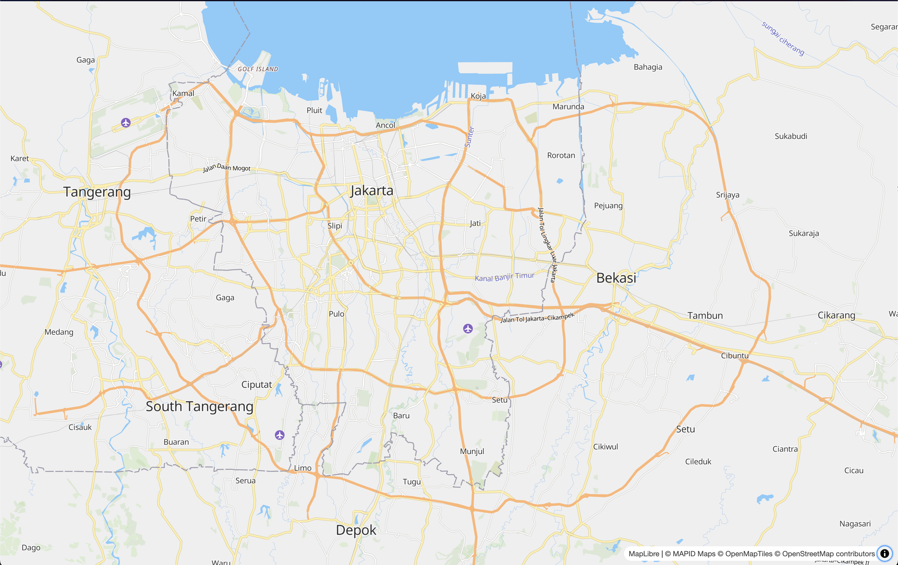
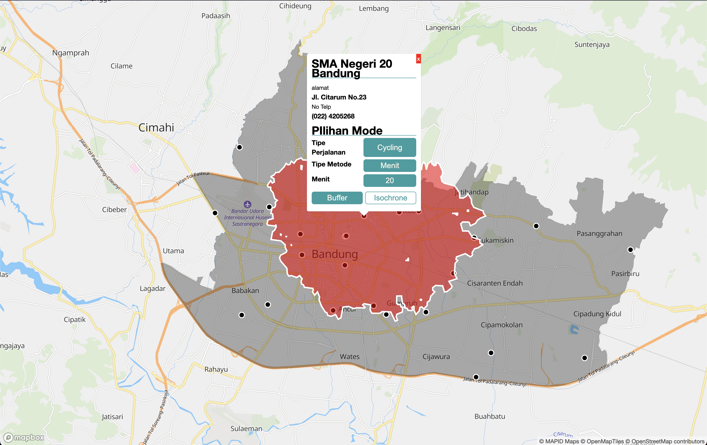
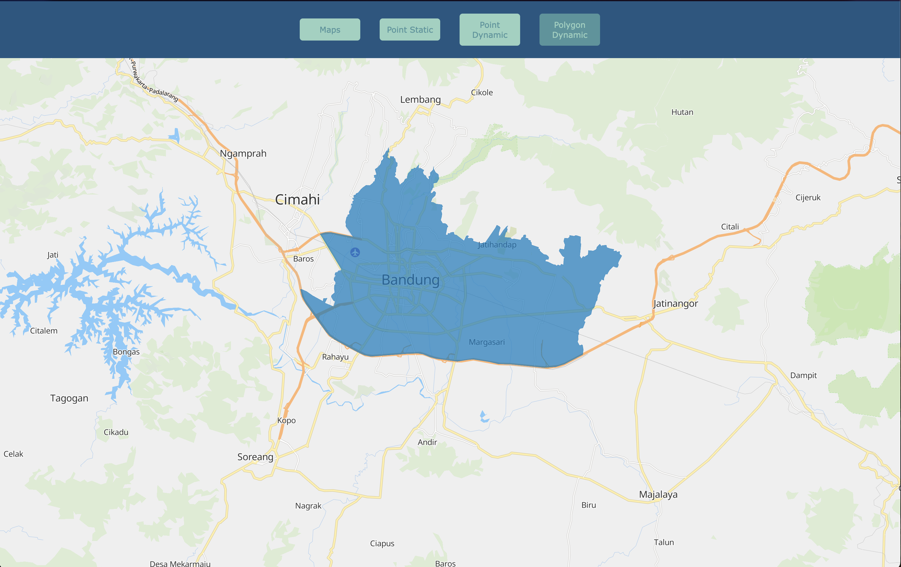

# Penggunaan Basemap Mapid

MAPID Maps adalah salah satu produk dari MAPID yang menyediakan layanan pemetaan berbasis cloud dengan fitur GIS (Geographic Information System) yang dapat digunakan untuk analisis spasial, visualisasi data, dan pengelolaan informasi geospasial. MAPID Maps memungkinkan pengguna untuk mengakses peta dasar (basemap), melakukan analisis spasial, serta menggunakan layanan seperti routing, geocoding, dan pemetaan berbasis API.

Untuk dokumentasi selengkapnya bisa dibaca disini : 
1. [Source Code](https://github.com/egipratama/wgc-mapid-2025)
2. [Mendapatkan API Key](https://github.com/egipratama/wgc-mapid-2025/blob/master/APIKEY.md) 
3. [Style map](https://github.com/egipratama/wgc-mapid-2025/blob/master/MAPSTYLE.md)

## File
Dalam repository ini saya membuat dalam beberapa case, yang bisa sebagai contoh penggunaan Basemap Mapid. Dengan dibagi berdasarkan teknologi yang akan digunakan. Berikut daftar folder untuk beberapa teknologi.

### javascript
Dalam folder javascript berisi penggunaan basemap mapid menggunakan teknologi vanila javascript. Saya membuat beberapa contoh untuk beberapa case dalam file terpisah. 
1. Penggunaan basemap
2. Penggunaan Data Point
3. Penggunaan Data Line
4. Penggunaan Data Polygon
5. Penggunaan Data Marker
6. Penggunaan Data Navigation
7. Penggunaan Data dengan file JSON (Jalankan dengan live server)

### ReactJS
Dalam folder ReactJS berisi penggunaan basemap mapid menggunakan teknologi ReactJS yang berfungsi sebagai Framework FrontEnd pada bahasa pemrograman JavaScript. 

Saya memberikan contoh yang sedikit rumit, dimana terdapat GeoProsessing yang terjadi dalam code yang saya buat, terdapat fitur buffer dan isochrone yang mengambil dari api MapBox

### FullStack
Dalam folder FullStack berisi penggunaan basemap mapid menggunakan teknologi Fullstack yang memakai bahasa pemrograman JavaScript. Untuk bagian FrontEnd menggunakan ReactJS, bagian Backend menggunakan ExpressJS, dan database menggunakan postgresql. 

Saya membuat contoh yang simple dimana untuk menampilkan basemap, menampilkan data static, dan data dynamic dari point dan Polygon. Dimana untuk data dynamic dari point dan polygon diambil dari data yang dikirim Backend menggunakan RestAPI sebagai media pertukaran data.

## Source Reference

 - [MAPID](https://mapid.co.id/)
 - [GEOMAPID](https://geo.mapid.io/)
 - [MAPID MAPS](https://github.com/egipratama/wgc-mapid-2025/tree/master)
 - [MapLibre gl](https://maplibre.org/maplibre-gl-js/docs/)
 - [Mapbox](https://www.mapbox.com/)
